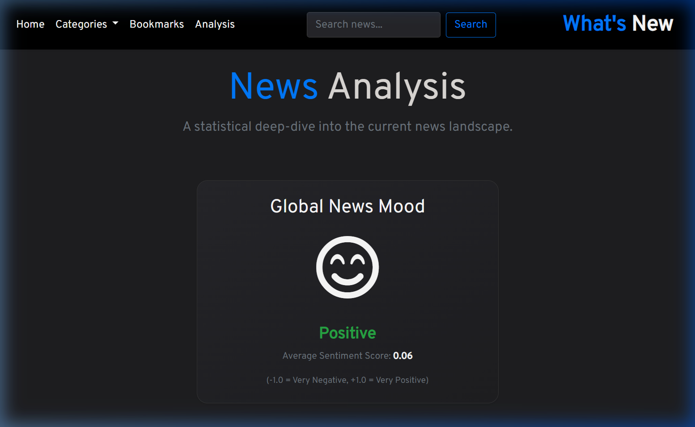
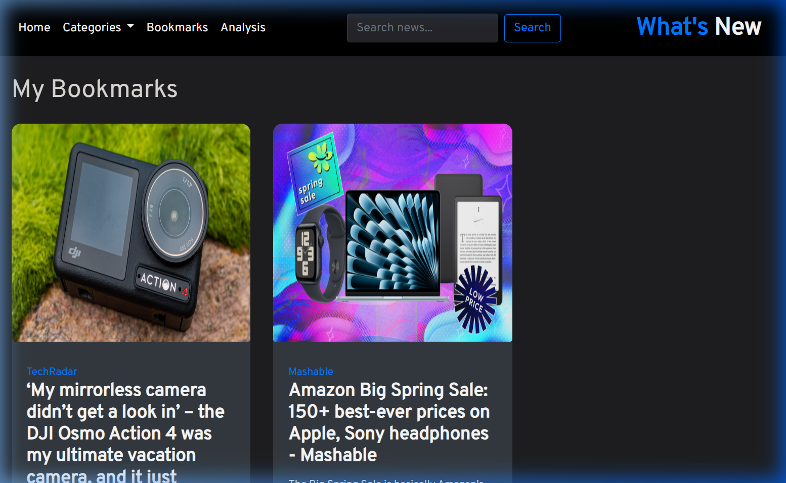

# What's New

A minimalist news aggregation and sentiment analysis platform built with Flask. This application provides real-time global news coverage while analyzing the emotional tone of the headlines to provide insights into the current media landscape.

## Features

- Unified News Feed: A consolidated view of top headlines and categorized articles.
- Search Functionality: Ability to search for news articles across all global sources using keywords.
- Sentiment Dashboard: Visual representation of the news mood across multiple industries.
- Persistent Bookmarks: Save articles for later reading using a local or cloud-based relational database.
- Live Summary Strip: A high-density horizontal ticker for rapid news consumption.
- Category Filtering: Dedicated sections for business, technology, science, and more.

## Interface

### Sentiment Analysis


### Saved Bookmarks


## Technical Architecture

### Sentiment Engine
The platform utilizes TextBlob for natural language processing. It calculates polarity scores for headlines across six major categories, aggregating them into a "Global News Mood" (Positive, Neutral, or Negative).

### Thread-Safe Caching
To optimize performance and respect API rate limits, a custom caching layer is implemented using Python's `threading.Lock`. Data is cached for 10 minutes (TTL) to ensure fresh content while minimizing redundant network requests.

### Database Support
The application supports a dual-mode database system for maximum flexibility:
- **Local Development**: Default to a local SQLite database (`news_hub.db`).
- **Production Deployment**: Seamless integration with **Turso** (libSQL) to ensure data persistence on serverless platforms like Vercel.

### API Integration
Real-time data is fetched through NewsAPI, which is then formatted and cleaned server-side before being served to the frontend templates.

## Getting Started

### Prerequisites
- Python 3.9 or higher
- NewsAPI Key from newsapi.org

### Setup

1. Clone the repository:
   ```bash
   git clone https://github.com/veershah282/What-s-New.git
   ```

2. Configure environment variables in a `.env` file:
   ```env
   NEWS_API_KEY=your_news_api_key
   SECRET_KEY=your_secret_key
   
   # Optional: For Cloud Persistence (Turso)
   TURSO_DATABASE_URL=libsql://your-db-url.turso.io
   TURSO_AUTH_TOKEN=your-token
   ```

3. Install dependencies and run:
   ```bash
   pip install -r requirements.txt
   python main.py
   ```